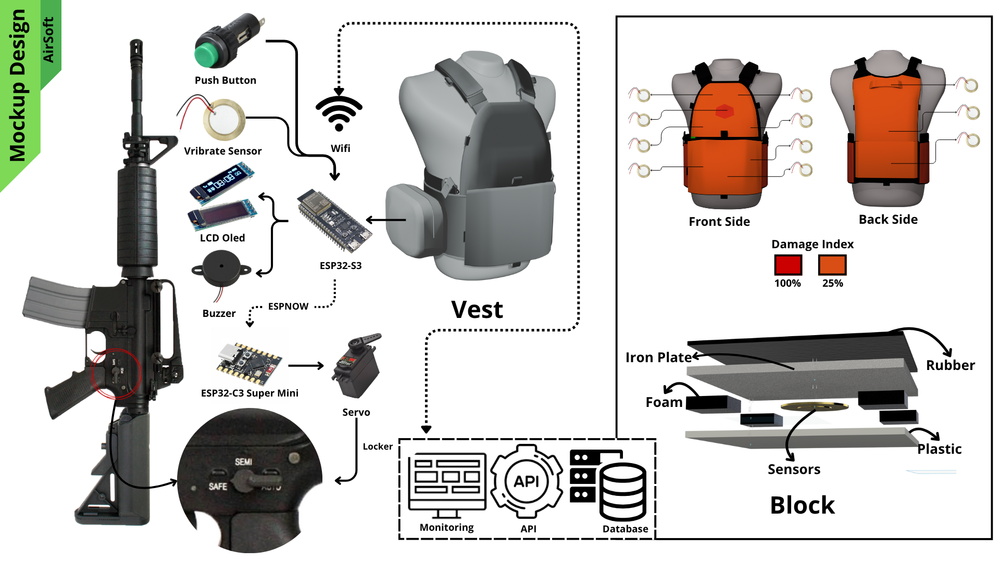

# 🎯 SmartVest - Airsoft Hit Detection System

**SmartVest** is a smart wearable system designed for airsoft games and tactical training scenarios. It provides **real-time hit detection** by sensing BB pellet or rubber projectile impacts through an array of pressure and vibration sensors. Inspired by video game mechanics, SmartVest delivers immersive and measurable training by mapping impact zones and giving instant feedback to the player or trainer.

---

## 🧩 Project Mockup

Here's a visual mockup of the SmartVest system design:

---

## 💡 What Does It Do?

SmartVest detects and classifies hits from projectiles (BBs or rubber bullets) on a player’s body using multiple force and vibration sensors embedded within a vest. It is especially designed to:

- **Track and identify projectile impacts**
- **Map hit locations across multiple zones**
- **Differentiate real hits from fake or foreign object contacts**
- **Deliver immediate feedback (visual/audio)**
- **Log and transmit hit data to a central server or controller**

---

## 🚀 Features

- 🔹 **Multi-zone sensor detection** across the front/back of the vest  
- 🔹 **Impact classification**: distinguishes between projectile hits and non-projectile impacts  
- 🔹 **Wireless communication options**:
  - **ESP-NOW**: for ultra-fast low-latency peer-to-peer communication between gun and vest
  - **Wi-Fi**: for real-time data upload to central monitoring system (e.g. Raspberry Pi, server, dashboard)
  - **LoRa (optional)**: for long-range communication in outdoor or field operations  
- 🔹 **Customizable configuration**: adaptable to different body sizes, game rules, and environments  
- 🔹 **Modular system**: sensors and controllers can be reconfigured for different game modes or teams  
- 🔹 **Game-style feedback system**: supports LEDs, buzzers, or even vibration motors to simulate in-game responses

---

## 📦 Project Structure

